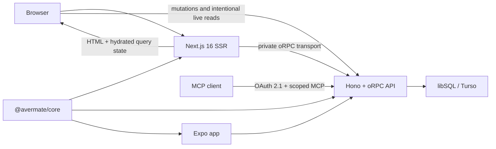

# Avermate

Avermate is a grade tracker that explains the number, not just records it.
Model a school year with real coefficients and nested subjects, see what each
result changed, and work backwards from a target to the marks that can reach it.

The repository contains an SSR-first web application, a native Expo client, a
typed oRPC API with a protected MCP server, and one shared calculation engine.

## What Avermate does

- Tracks ordinary and composite grades, coefficients, notes, periods, and
  multiple school years.
- Models nested subjects and transparent categories without changing the
  weighting rules.
- Calculates general, subject, and custom averages from the same domain engine.
- Presents grades as a timeline, hierarchy, or calendar on the web and as a
  grouped, searchable native history in Expo.
- Explains grade and subject impact, trends, distributions, consistency,
  streaks, and projected results.
- Turns goals into concrete required marks and flags targets that are secured,
  at risk, achieved, or unreachable.
- Provides 21 configurable dashboard metrics, an immersive year review,
  themes, and English/French localization.
- Lets administrators publish versioned curriculum presets. Linked years can
  adopt reviewed updates, while the first student customization visibly and
  safely moves that year out of automatic updates until a preset is explicitly
  reapplied.
- Offers an optional private social space for friends, circles, and invite-only
  study groups or classes. Profile fields and derived comparison metrics are
  shared only after explicit consent; there is no Internet-public grade
  profile.
- Runs as a responsive Next.js web app and a dedicated Expo iOS/Android app.
- Includes email/OAuth authentication, data export, global or preset-targeted
  announcements, centralized bug/feature-request triage, social moderation,
  and administration. Email and upload integrations activate when their
  services are configured.
- Exposes scoped academic and social operations to compatible AI assistants
  through an OAuth-protected MCP 2026-07-28 endpoint.

Interactive analytics use TanStack Charts on the web and inside an Expo DOM
surface on native. Time-series views support localized tooltips, independently
resolved active points, mouse/trackpad/touch zoom and pan, keyboard controls,
responsive layouts, reduced motion, and light/dark themes. Small decorative
charts intentionally omit interaction.

## Architecture



The web app treats Server Components as the default. Next authenticates and
prefetches common read models on the server, then TanStack Query hydrates only
the small browser islands that need a live cache. The same generated oRPC query
options are used on both sides, avoiding duplicate keys and immediate refetches.
When `API_INTERNAL_URL` is configured, production SSR calls the API over its
private service address; the browser does not relay data the server already
knows. Interactive charts receive their normalized dataset through this server
path instead of fetching it again just because the chart surface runs on the
client.

TanStack Charts `0.11.0` is pinned exactly because the package is pre-alpha.
Charts are built from native marks, scales, focus strategies and tooltips; the
application adds a reusable semantic-domain interaction controller instead of
recreating the old Recharts component API.

The MCP endpoint delegates to the same oRPC procedures as the applications, so
ownership, authorization, validation, and calculations have one source of
truth. OAuth scopes separate academic reads/writes/deletes, administration, and
private social operations; destructive tools use explicit multi-round
confirmation and idempotent replay protection.

For implementation details and measured request reductions, see
[SSR and data loading](docs/ssr-data-loading.md),
[chart architecture](docs/charts.md), [MCP](docs/mcp.md), and the
[social privacy contract](docs/social-privacy.md). The current `main` →
`rewrite` acceptance matrix lives in [feature parity](docs/feature-parity.md).

## Technology

| Layer          | Main technology                                                 |
| -------------- | --------------------------------------------------------------- |
| Web            | Next.js 16, React 19, TypeScript, Tailwind CSS 4, next-intl     |
| Server state   | TanStack Query 5, oRPC 1.14                                     |
| Charts         | TanStack Charts 0.11, D3 shape primitives                       |
| API            | Bun, Hono, oRPC, MCP TypeScript SDK 2, Zod                      |
| Authentication | Better Auth with Drizzle, email OTP, OAuth and Expo support     |
| Database       | Drizzle ORM over libSQL/Turso or a local SQLite-compatible file |
| Mobile         | Expo SDK 57, Expo Router, React Native 0.86, Expo Widgets       |
| Workspace      | Bun 1.3.14 workspaces and Turborepo                             |

## Repository layout

```text
apps/
  server/    Hono/oRPC API, authentication, database schema and scripts
  web/       Next.js application and SSR/query/chart integration
  mobile/    Expo Router application and opt-in iOS system widget
packages/
  core/      Pure averages, analytics, goals and review domain engine
docs/
  charts.md
  feature-parity.md
  mcp.md
  social-privacy.md
  ssr-data-loading.md
deploy.yml   Reference Traefik/Docker Compose deployment
```

`@avermate/core` is consumed as TypeScript source by all three applications. It
has no database or network dependency, so the same arithmetic drives server
responses, interactive simulations, native screens, and unit tests.

## Requirements

- [Bun 1.3.14](https://bun.sh/) — the version pinned by `packageManager` and CI.
- A libSQL database. `file:./dev.db` is enough locally; Turso or another durable
  libSQL endpoint is recommended for deployment.
- For native development, the platform requirements for Expo, Xcode and/or
  Android Studio.
- Docker and an existing Traefik `webgateway` network only if using the supplied
  deployment file.

## Local setup

```bash
git clone https://github.com/Fefe-Nayz/avermate.git
cd avermate
bun install --frozen-lockfile

cp apps/server/.env.example apps/server/.env
cp apps/web/.env.example apps/web/.env.local
```

On PowerShell, use `Copy-Item` instead of `cp`. Set a unique
`BETTER_AUTH_SECRET` of at least 32 characters in `apps/server/.env`, then create
the local schema and start the workspace:

```bash
bun run db:migrate
bun run dev
```

The API listens on `http://localhost:5000` and the web app on
`http://localhost:3000` with the example configuration. Run one process at a
time with `bun run dev:server`, `bun run dev:web`, or `bun run dev:mobile`.

### Environment variables

The checked-in example files are the source of truth:

- `apps/server/.env.example`
- `apps/web/.env.example`

Required server values:

| Variable             | Purpose                                                  |
| -------------------- | -------------------------------------------------------- |
| `DATABASE_URL`       | libSQL/Turso URL or local `file:` URL                    |
| `BETTER_AUTH_URL`    | Public API/auth origin, normally `http://localhost:5000` |
| `BETTER_AUTH_SECRET` | Unique signing/encryption secret, minimum 32 characters  |
| `CLIENT_URL`         | Trusted public web origin                                |

Required web values:

| Variable              | Purpose                                           |
| --------------------- | ------------------------------------------------- |
| `NEXT_PUBLIC_API_URL` | API origin used by browser islands                |
| `NEXT_PUBLIC_APP_URL` | Public web origin                                 |
| `API_INTERNAL_URL`    | Optional private API origin used only by Next SSR |

Optional server integrations include `DATABASE_AUTH_TOKEN`, Google and
Microsoft OAuth credentials, `RESEND_API_KEY`, `EMAIL_FROM`,
`UPLOADTHING_TOKEN`, and `ADMIN_USER_IDS`. The `DISABLE_EMAIL` and
`DISABLE_UPLOADS` flags are local-development escape hatches. Bug reports and
feature requests are stored in Avermate and triaged from the protected admin
panel; they are not relayed to Discord.

The MCP endpoint is available at `${BETTER_AUTH_URL}/mcp` by default.
Production deployments should set an independent `MCP_REQUEST_STATE_SECRET`;
`MCP_RESOURCE_URL`, proxy allow-lists, and the disabled-by-default transitional
DCR switch are documented in `apps/server/.env.example` and
[docs/mcp.md](docs/mcp.md). Private social features fail closed and remain
globally disabled until an administrator enables them; every participant still
has to complete the applicable consent flow.

When production web and API hosts are trusted sibling subdomains, set
`AUTH_COOKIE_DOMAIN` to the narrowest parent they share. Leave it unset for
host-only local cookies. Do not include unrelated or untrusted subdomains in
that scope.

The mobile app usually discovers the Metro host automatically. Set
`EXPO_PUBLIC_SERVER_URL` when it should use a deployed API or discovery is not
available.

## Useful commands

Run these from the repository root unless noted otherwise.

| Command                                          | Purpose                                            |
| ------------------------------------------------ | -------------------------------------------------- |
| `bun run dev`                                    | Start all development tasks                        |
| `bun run dev:web`                                | Start Next on port 3000                            |
| `bun run dev:server`                             | Start the API on port 5000                         |
| `bun run dev:mobile`                             | Start Expo/Metro                                   |
| `bun run build`                                  | Build all workspaces for production                |
| `bun run check-types`                            | Typecheck all workspaces                           |
| `bun run lint`                                   | Run the web ESLint gate                            |
| `bun run format:check`                           | Check web-workspace formatting                     |
| `bun run format`                                 | Format the web workspace                           |
| `bun run test`                                   | Run unit, contract and integration tests           |
| `bun run db:push`                                | Push the current schema to the configured database |
| `bun run db:generate`                            | Generate Drizzle migrations                        |
| `bun run db:migrate`                             | Apply generated migrations                         |
| `bun run db:studio`                              | Open Drizzle Studio                                |
| `bun run admin:set -- user@example.com`          | Grant an existing user the admin role              |
| `bun run admin:set -- user@example.com --revoke` | Revoke the database admin role                     |

Native builds are available through `bun run --cwd apps/mobile ios` and
`bun run --cwd apps/mobile android` once the platform toolchain is installed.
`bunx expo export --platform all` from `apps/mobile` verifies the iOS, Android,
and static web bundles. The in-app widget library is cross-platform; the
privacy-redacted operating-system widget currently targets iOS through the
official `expo-widgets` integration and is opt-in.

## Demo data

```bash
bun run db:seed
```

This recreates two showcase accounts and a deterministic synthetic cohort with
password `demo-account-2026`:

- `demo@avermate.fr` contains two years, periods, a nested subject tree,
  ordinary and composite grades, notes, custom averages, goals in every planner
  state, and dashboard cards.
- `new@avermate.fr` is empty and opens onboarding.
- 48 identities under `@seed.avermate.example` populate the administration
  views with varied roles, verification and suspension states, sign-in
  providers, sessions, activity dates, 90 academic years, roughly 2,250
  hierarchical subjects, and roughly 8,000 grades. Three accounts intentionally
  remain pre-onboarding. The distribution mirrors
  anonymised CPGE usage patterns without containing any real account data.

Seed only the cohort, choose its size, or reproduce another distribution with:

```bash
bun run db:seed -- --cohort
bun run db:seed -- --cohort --users 80 --seed 1234
```

Use `--full` or `--blank` to seed only one showcase account. The script also
accepts `--email`, `--name`, and `--password` for a custom showcase identity.
Synthetic cleanup is restricted to the reserved `.example` namespace. Every
seed mode is rejected in production and on non-file databases.

## Production and deployment

Build and run the applications directly:

```bash
bun run build
bun run --cwd apps/server start
bun run --cwd apps/web start
```

The supplied Dockerfiles produce a Bun API image and a Next standalone image.
The GitHub Actions workflow checks formatting, lint, types and tests on pull
requests, then publishes both images to GHCR from `main`. `deploy.yml` is a
reference deployment for the canonical `avermate.nayz.fr` and
`api.avermate.nayz.fr` hosts behind Traefik.

Before using it:

1. Fill every required API/web environment value and use a strong auth secret.
2. Set `API_INTERNAL_URL` to the API service address and, for sibling hosts,
   configure the narrow shared `AUTH_COOKIE_DOMAIN`.
3. Use a durable remote libSQL database or add an explicit persistent volume
   for a file database; the reference Compose file does not provide one.
4. Create or rename the external Traefik network expected as `webgateway`.
5. For other public domains, change the web Dockerfile's build-time
   `NEXT_PUBLIC_*` values before building. Next inlines public variables into
   the client bundle; runtime Compose values cannot replace them afterward.

The API container applies reviewed migrations on startup and fails closed if a
migration cannot complete. It never falls back to a forced schema push. Review
backups and migration output before a production upgrade.

## Migrating an Avermate v1 database

Start with a dry run:

```bash
LEGACY_DATABASE_URL=file:/path/to/old.db \
  bun run db:migrate-legacy -- --dry-run
```

For a remote legacy database, also set `LEGACY_DATABASE_AUTH_TOKEN`. Remove
`--dry-run` to write. The migration preserves ids, converts scaled
coefficients/values, maps display subjects to categories, normalizes custom
average entries, and is designed to be idempotent. Back up both databases
before the write run.

## Contributing

1. Create a focused branch from the branch you intend to target.
2. Keep domain logic in `packages/core` when it is independent of transport or
   presentation, and keep client boundaries as small as the interaction needs.
3. Add or update English and French messages together.
4. Run `bun run format:check`, `bun run lint`, `bun run check-types`,
   `bun run test`, and `bun run build` before opening a pull request.
5. Describe database, environment, SSR/cache, and network-behavior changes in
   the pull request when relevant.

## Project status

The rewrite architecture is active development. The academic, SSR, chart,
managed-preset, private-social, centralized-feedback, MCP, and Expo surfaces are
implemented and covered by automated checks; real-device authentication,
multi-touch, widget, theme, and assistive-technology smoke tests remain release
gates. TanStack Charts is pinned to a pre-alpha release, so its interaction
contract tests and manual browser/touch checks are required for upgrades.
Production email, OAuth, uploads, durable database storage, domains, and reverse
proxy are operator-configured rather than bundled services. Social rollout also
requires an explicit administrator decision and jurisdiction-appropriate
privacy review.

No project license is currently declared in this repository. Do not assume
permission to redistribute the code until the maintainers add one.
