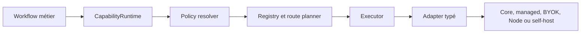

# ADR 040 — Registre de capacités et routage d'inférence

- Statut : accepté
- Date : 28 août 2026
- État d'implémentation revérifié : 30 août 2026 ; rollout opt-in, legacy conservé
- Portée : Core hébergé, BYOK, Avermate Node et full self-host

Guide de déploiement et de rollout :
[`capability-registry/operator-guide.md`](../capability-registry/operator-guide.md).

## Contexte

Les traitements IA d'Avermate ont grandi par verticales : génération de langage,
embeddings, reranking, transcription, synthèse vocale, OCR et extraction de
documents. Chaque verticale possède de bonnes garanties locales, mais plusieurs
workflows choisissent encore directement un fournisseur, une variable
d'environnement ou un placement. Cette forme rend l'ajout d'une connexion, d'un
second fournisseur ou d'un moteur Node plus coûteux et fragilise l'audit des
fallbacks.

`ModelGateway` reste une façade utile pour le chat existant, mais son contrat
`stream/embed/transcribe/estimate` ne décrit pas correctement les capacités qui
n'ont rien d'un modèle de langage. Le registre ne remplacera donc pas ce
méga-contrat par un autre méga-contrat optionnel.

## Décision

Avermate possède un control plane de capacités constitué de quatre couches.
Le flux suivant s'applique au mode `registry` ; le mode par défaut des familles
migrées reste `legacy` :



Sur le chemin registry, un workflow exprime une capacité, un purpose et des
exigences. L'invoker reçoit une requête typée et une clé d'idempotence, pas un
nom de fournisseur :

```ts
await capabilityRegistryInvoker.invoke({
  ownerId,
  capability: "speech.transcribe",
  purpose: "recordings.course-transcription",
  request,
  idempotencyKey,
});
```

`CapabilityRuntime` est la façade de rollout qui choisit la branche legacy,
shadow ou registry ; elle n'est pas une API HTTP de dispatch arbitraire. Les
branches provider historiques restent présentes dans la compatibilité tant que
le nettoyage legacy n'a pas été effectué.

Le registre distingue explicitement :

1. le plugin provider, qui contient du code revu ;
2. la connexion, qui appartient à une instance, un utilisateur ou un Node ;
3. l'offering immuable découverte pour une capacité précise ;
4. la policy applicable à un purpose ;
5. le route plan figé pour une opération ;
6. l'opération durable ;
7. ses tentatives et son usage normalisé.

Les identifiants de capacité v1 sont :

```text
language.generate
embedding.generate
rerank.score
speech.transcribe
speech.synthesize
document.ocr
document.extract
image.generate
video.generate
```

Image et vidéo sont des contrats réservés, sans workflow registry activé.
`document.extract` couvre actuellement la couche texte native PDF ; les autres
formats documentaires ne sont pas tous migrés vers le nouveau contrat.

## Autorité et adaptation

Le registre, les policies, les consentements, les secrets, la santé, les quotas,
le routage et l'accounting sont autoritatifs dans Avermate.

Vercel AI SDK est une couche d'adaptation lorsque son contrat convient. Les
providers OpenAI-compatibles, LiteLLM et Hugging Face sont des familles de
connexions, pas la source de vérité du routage. L'OCR, l'extraction documentaire
et les protocoles non couverts utilisent des adapters Avermate natifs.

Les plugins ElevenLabs TTS et Deepgram STT utilisent leurs SDK officiels.
LiteLLM et Hugging Face exposent uniquement du chat compatible text-only avec
modèle et révision explicites. HF exige un suffixe de provider non automatique ;
LiteLLM exige un deployment unique sans routage/fallback caché, confirmé par
l'opérateur et renforcé par les flags de requête. Une API compatible ne prouve
ni vision, ni tools, ni génération média.

Le connecteur OpenRouter registry épingle également son modèle et son upstream
OpenAI, désactive les fallbacks provider/modèle et utilise un probe de token
authentifié. Le catalogue public d'un agrégateur ne valide pas un credential.

Le Core hébergé ne charge jamais un package, une URL de module ou du code fourni
par un utilisateur. Un provider personnalisé s'exécute sur un Node sous la forme
d'un worker ou sidecar et ne traverse la frontière Core qu'au moyen du protocole
de capacité signé.

## Routage

Le route planner applique d'abord les contraintes, puis seulement le scoring :

```text
policies système et plan
→ préférences utilisateur/projet/workflow
→ protocole, modalités, features et limites
→ placement et frontière de données
→ credential et consent readiness
→ santé et estimation de coût lorsqu'elle est disponible
→ ordre explicite ou score déterministe
→ route primaire et fallbacks figés
→ contrôles et réservations de quota managed avant dispatch
```

Un fallback n'est jamais caché dans un SDK. Une escalade de confidentialité,
notamment Node local vers cloud, est refusée sans consentement et policy
explicites. Le route plan n'est pas recalculé pendant une opération.

## Embeddings

Une offering d'embedding décrit comment appeler un moteur. Un espace vectoriel
décrit la sémantique immuable de ses vecteurs. Les deux identités restent
séparées.

Un fallback vers un espace incompatible est interdit, même si ses dimensions
sont identiques. Un changement de modèle, de révision, de normalisation ou de
prétraitement produit un nouvel espace et une nouvelle génération publiée avec
les fences atomiques existants.

## Secrets, consentements et publication

Les secrets sont write-only et loués par slot à une tentative. Une offering ne
contient jamais de secret. Le runtime revalide credential, consentement et
policy avant dispatch, puis avant publication. Une révocation concurrente peut
laisser finir l'appel externe, mais bloque la publication du résultat.

Les secrets Node restent dans le secret store du Node. Le Core ne reçoit qu'un
slot, un état, une version abstraite et un hint non sensible.

L'API publique de connexions est user-scoped et accepte seulement le BYOK
direct ou un Node appartenant au compte. Elle ne confère aucune autorité
opérateur sur les placements `core`, `managed` ou `full-self-host`. Les policies
publiques sont également limitées au scope utilisateur, même si le resolver
sait composer des scopes système/projet/workflow.

Une modification de connexion ou une validation échouée avance sa révision et
retire les anciennes offerings dans la même transaction. Les listes de
planification filtrent la révision courante et l'expiration. Une simple
revalidation réussie d'une connexion déjà prête conserve sa révision et les
policies épinglées ; après désactivation/réactivation il faut redécouvrir et
sélectionner les nouvelles offerings. La suppression logique conserve les
opérations, les tentatives et leurs références historiques.

## Opérations et usage

Une opération persiste le digest de l'entrée canonique, l'idempotency key, les
snapshots de policy et de route, les digests et le résultat. Elle ne conserve
pas l'entrée brute permettant de rejouer arbitrairement le workflow. Une
tentative vise une offering exacte. Les erreurs provider sont traduites dans
la taxonomie Avermate. Le résultat, l'usage et la transition de fin sont
atomiques ; un replay identique ne double pas l'usage et un replay divergent
est refusé. Une annulation ne peut pas être annulée par un échec tardif.

L'usage est multi-unité : tokens, caractères, secondes audio/vidéo, pages,
images, mégapixels, candidats ou vecteurs. Les unités et coûts inconnus restent
explicitement inconnus. Pour le managed, un broker réserve les quotas avant
dispatch et règle les mesures disponibles après validation ; après un dispatch
incertain, il conserve une borne prudente non autoritative. Une route managed
sans broker ou sans contrat de quota adapté échoue avant l'appel. Ce mécanisme
n'active ni pool ni prix par défaut et n'est pas une facturation universelle
de tous les fournisseurs BYOK.

Une coupure après acknowledgment sans idempotence provider place l'opération en
`inspect-required` ; elle ne déclenche pas automatiquement un second appel
potentiellement facturable.

Le retry générique d'une opération n'est pas exposé : après résolution de
l'incident, la relance se fait depuis le workflow d'origine, qui reconstruit
les inputs, captures d'autorité et identités nécessaires.

La santé des offerings expire après cinq minutes et les invocations peuvent
effectuer un nouveau probe minimal. Le read model distingue panne, auth et
désactivation ; ce n'est pas un monitoring continu. Les diagnostics shadow
sont bornés en mémoire, contrairement au ledger durable d'opérations.

## Avermate Node

Le manifest signé expose une section `inference` v1 optionnelle contenant des
offering descriptors bornés, leurs digests, la révision du runtime, l'image et
la policy d'egress. Aucun endpoint privé ou chemin de secret n'est publié.

Le protocole générique `capability.invoke@1` borne le Node, l'owner, l'offering,
la révision de configuration, les artefacts, les digests, les ressources et la
durée. Les opérations historiques `models`, `retrieval`, OCR et transcription
restent compatibles via des bridge offerings pendant la migration.

Les inputs média sont transférés et vérifiés dans le stockage du Node avant
dispatch. Les outputs sont relus, contrôlés puis adoptés avec une identité
idempotente avant publication Core. Les sidecars implémentent un protocole de
fichiers borné (`inline-base64-v1`) ; un chemin Core ou une référence d'objet
n'est jamais supposé directement accessible dans leur conteneur.

`CapabilityArtifactIo.write` et l'adoption des sorties d'inférence Node par
`CapabilityArtifactIo.adopt` préservent le stockage choisi Node/local/S3, avec
adoption durable en deux phases. Les références canoniques de fichiers dans le
Core ne supposent pas des octets hébergés par le Core.
Les transferts ambigus bloquent le retry automatique et conservent les inputs ;
les échecs d'adoption conservent les outputs pour inspection.

## Compatibilité et rollout

Les sept familles migrées utilisent un flag `legacy | shadow | registry`,
avec `legacy` par défaut. Image et vidéo restent legacy. En shadow, le
nouveau planner résout et compare la route sans exécuter un second appel payant.
Les façades existantes restent en place jusqu'à la migration de tous leurs call
sites.

La migration suit l'ordre suivant : TTS, STT, OCR/extraction, reranking,
embeddings, puis génération de langage. La suppression des variables et types
legacy n'arrive qu'après une période de compatibilité et des tests de
conformance verts.

Le bridge de clés est une projection read-only, pas une conversion automatique
en connexions actives. L'extraction native PDF possède un bootstrap interne
étroit. Le nettoyage legacy et la conversion du bootstrap opérateur sont
prévus en phase 14 après la release de compatibilité. Le catalogue exhaustif
upstream et les formats d'extraction restants sont des suites de l'audit cible,
pas des fonctionnalités implicitement terminées. Les preuves
live provider/Node et self-host restent distinctes des tests locaux.

## Conséquences

### Positives

- Les workflows ne changent plus lors de l'ajout d'un provider.
- Le SaaS, BYOK, Node et full self-host partagent les mêmes contrats.
- Les fallbacks, coûts, consentements et placements deviennent observables.
- Les snapshots historiques restent reproductibles.
- Le Core garde une frontière d'exécution sûre.

### Coûts

- La persistance et le nombre d'objets de domaine augmentent.
- Les providers doivent satisfaire une suite de conformance.
- Les bridges legacy restent temporairement nécessaires.
- Les changements d'embedding exigent une réindexation plutôt qu'un fallback
  opportuniste.

## Anti-objectifs

- Pas de branche `if (provider === ...)` dans un workflow métier.
- Pas d'interface universelle à méthodes optionnelles.
- Pas de `providerOptions` arbitraires venant du navigateur.
- Pas de code provider non revu dans le Core.
- Pas d'escalade de confidentialité implicite.
- Pas de fallback d'embedding inter-espace.
