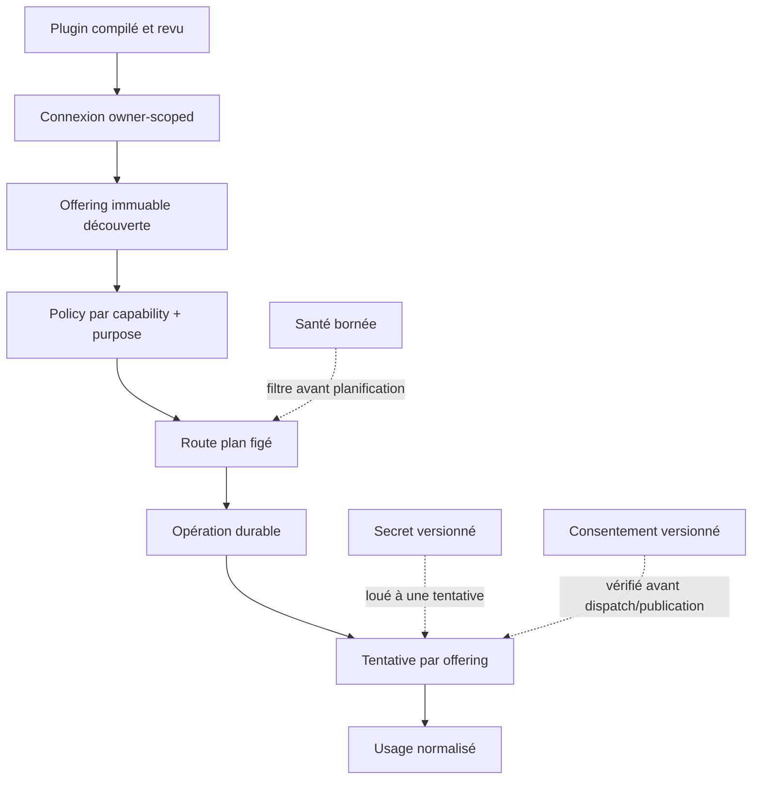

# Exploiter le registre de capacités

Ce guide complète l'[ADR 040](../adr/040-capability-registry.md). État du code
vérifié le 30 août 2026. Il décrit le rollout et les preuves attendues ; il ne
remplace pas les disclosures propres à chaque fournisseur. Les chemins registry
sont livrés derrière des flags, pas activés globalement par défaut.

## Objets et responsabilités



- Le navigateur envoie une intention et des secrets write-only. Il ne reçoit
  jamais un ciphertext, une référence de coffre ou un secret Node.
- Le Core est autoritaire pour la policy, les consentements, le plan figé et le
  ledger d'opérations.
- Un Node reste autoritaire pour ses secrets locaux, ses workers/sidecars et les
  artefacts dont le placement lui a été confié.
- Un SDK provider ne choisit jamais un fallback pour Avermate.

## Rollout par famille

Chaque famille possède un flag indépendant :

```env
CAPABILITY_REGISTRY_SHADOW=false
CAPABILITY_TTS_EXECUTION=legacy
CAPABILITY_STT_EXECUTION=legacy
CAPABILITY_OCR_EXECUTION=legacy
CAPABILITY_DOCUMENT_EXTRACTION_EXECUTION=legacy
CAPABILITY_RERANK_EXECUTION=legacy
CAPABILITY_EMBEDDING_EXECUTION=legacy
CAPABILITY_LANGUAGE_EXECUTION=legacy
```

Les sept valeurs ci-dessus sont les valeurs par défaut du runtime. Les contrats
`image.generate` et `video.generate` existent, mais leurs workflows ne sont pas
migrés et restent `legacy` ; il n'existe pas de flag de famille les activant.

`CAPABILITY_REGISTRY_SHADOW=true` place en `shadow` uniquement les familles
restées sur leur valeur legacy implicite. Un override explicite par famille,
y compris `legacy`, reste prioritaire. Si votre fichier `.env` définit déjà
tous les flags à `legacy`, le master shadow ne les changera donc pas : retirer
l'override concerné ou le passer explicitement à `shadow`.
La résolution registry en shadow ne déclenche ni adapter, ni appel fournisseur,
ni artefact, ni réservation d'opération. Elle compare les routes déjà résolubles,
puis exécute une fois le chemin legacy. Préparer les connexions et offerings en
amont ; un mismatch peut simplement signaler une configuration registry absente.

Les valeurs sont :

| Mode       | Comportement                                                                                                                                                 |
| ---------- | ------------------------------------------------------------------------------------------------------------------------------------------------------------ |
| `legacy`   | Exécute uniquement le chemin de compatibilité actuel.                                                                                                        |
| `shadow`   | Résout le chemin legacy et le chemin registry, conserve une comparaison bornée en mémoire, puis exécute une seule fois le legacy. Aucun double appel payant. |
| `registry` | Exécute uniquement la policy et la route figée du registre. Une indisponibilité échoue explicitement ; elle ne réactive jamais le legacy.                    |

Ordre recommandé : TTS, STT, OCR/extraction, rerank, embedding puis langage.
Pour une famille :

1. créer les connexions registry et valider leurs slots ;
2. découvrir des offerings et vérifier leur data handling ;
3. accorder les consentements requis ;
4. créer des policies par purpose ;
5. passer en `shadow` et examiner les mismatches ;
6. exécuter la conformance locale sans provider payant ;
7. exécuter séparément le gate live opt-in ;
8. passer en `registry` ;
9. conserver la façade legacy durant au moins une release de compatibilité.

Les clés historiques sont affichées par un bridge read-only. Ce n'est pas un
import automatique : les variables `TTS_PROVIDER`, `OCR_PROVIDER`,
`TRANSCRIPTION_PROVIDER` et les clés legacy continuent à piloter le legacy,
mais ne créent pas à elles seules une connexion registry prête à exécuter.
Pour revenir au legacy, modifier explicitement le flag de la famille ; aucun
fallback implicite registry → legacy n'est exécuté.

## Connexions et secrets

Les contrats distinguent les connexions d'instance, d'utilisateur et de Node. La
configuration publique est reparsée par le schéma strict du plugin. Les origins
compatibles passent également la policy SSRF. Le Core n'accepte ni package, ni
module URL, ni `providerOptions` arbitraire provenant du navigateur.

L'API publique crée uniquement des connexions utilisateur en `direct-byok` ou
vers un Node activement pairé au même compte. Elle refuse `core`, `managed` et
`full-self-host` : ces placements nécessitent une autorité opérateur, pas une
case à cocher dans la requête utilisateur. Aucun bootstrap général des clés
opérateur/managed n'est livré ici. L'exception interne `avermate.native-document`
crée uniquement une connexion déterministe PDF sans secret ni accès réseau.

Les secrets sont soumis séparément :

```text
connexion publique
├── plugin + version
├── placement
├── config versionnée
└── slots déclarés

credential store
└── valeur chiffrée + version monotone + hint non sensible
```

Une tentative reçoit un lease court et lié à son identifiant. Une rotation ou
révocation rend le fence invalide avant dispatch ou publication. Les erreurs,
traces et exports ne doivent contenir ni valeur ni référence interne.

### Révisions et redécouverte

| Action                                                                       | Effet sur les routes                                                                                                  |
| ---------------------------------------------------------------------------- | --------------------------------------------------------------------------------------------------------------------- |
| Validation réussie d'une connexion déjà `ready`                              | Actualise la validation sans changer sa révision ; les policies épinglées restent utilisables.                        |
| Modification de configuration/placement/secret, y compris mise à jour du nom | Avance la révision, revient à `draft` et retire atomiquement les anciennes offerings.                                 |
| Validation échouée ou désactivation                                          | Avance la révision et retire les anciennes offerings ; aucun nouveau dispatch sur cette autorité.                     |
| Réactivation après désactivation/échec                                       | Valider, redécouvrir, vérifier le consentement puis sélectionner les nouvelles offerings dans les policies épinglées. |
| Suppression                                                                  | Soft-delete, secrets révoqués et offerings retirées ; opérations et snapshots historiques conservés.                  |

La liste utilisable ignore toute offering expirée, retirée ou d'une ancienne
révision. Une redécouverte peut rafraîchir les métadonnées d'une offering
identique, pas réécrire son descriptor immuable. Les snapshots passés ne sont
jamais repointés automatiquement vers un nouveau modèle ou une nouvelle clé.

### Santé et probes

La santé est par offering avec un TTL de cinq minutes. Une première panne
ordinaire donne `degraded`, trois échecs consécutifs `offline`, et un échec
d'authentification `unauthorized`. Après expiration, ces états deviennent
`unknown` ; `disabled` reste une décision explicite. Une invocation registry
redécouvre les offerings et effectue un probe minimal si la santé est absente
ou expirée. Un succès renouvelle le TTL ; ce n'est pas un daemon de monitoring
continu. La disponibilité UI en lecture seule ne lance pas ce probe et ne
doit pas être interprétée comme une preuve de service sain à cet instant.

Les mesures nommées p50/p95 dans le read model sont des indicateurs glissants
simples, pas des percentiles calculés sur un historique exhaustif. Les
mismatches shadow sont owner-scoped, limités à 500 par compte en mémoire du
processus et perdus au redémarrage ; le ledger d'opérations, lui, est durable.

## Providers et protocoles livrés

La [matrice d'inventaire](inventory.md) distingue les connecteurs compilés de
leurs capacités exactes : Mistral pour langage/embedding texte/STT/TTS/OCR,
ElevenLabs pour TTS et Deepgram pour STT via leurs SDK officiels, Gemini pour
embedding multimodal, Cohere pour reranking, OpenAI/OpenRouter pour langage,
OpenAI-compatible pour langage et embedding configuré, extraction native PDF
et offerings signées du Node. Les options non annoncées sont refusées ; une
réponse HTTP valide du probe ne prouve pas toutes les fonctionnalités du modèle.

LiteLLM et Hugging Face sont des connecteurs optionnels de chat compatible
text-only. Ils ne déclarent ni tools, ni vision, ni structured output, ni
génération image/vidéo ou transcription :

- LiteLLM : origin explicite, `modelId`, `modelRevision` et
  `singleDeploymentConfirmed: true`. Le proxy doit être configuré avec un seul
  upstream par deployment et sans groupes automatiques, retries ou fallbacks.
  Avermate transmet notamment `disable_fallbacks: true`, `num_retries: 0`,
  `max_fallbacks: 0` et des listes de fallback vides. Ces flags ne prouvent pas
  la configuration interne d'un proxy distant : l'opérateur reste responsable
  de ce prérequis. Les proxies privés passent par un Node, pas par le SaaS Core.
- Hugging Face : `modelId` au format `organisation/modèle:provider` et
  `modelRevision` explicite. Les sélections `auto`, `fastest`, `cheapest` et
  `preferred` sont refusées. La connexion utilise l'origin
  `https://router.huggingface.co` et un probe d'identité authentifié distinct.

Le connecteur OpenRouter registry épingle `openai/gpt-4.1-mini` et l'upstream
`openai` (`provider.only` et `provider.order`). Il fixe `allow_fallbacks: false`
et `require_parameters: true`, retire les champs de fallback `models`/`route`,
et valide le token via `/api/v1/key`, pas via le catalogue public de modèles.
Ces contraintes concernent ce chemin registry revu, pas toutes les anciennes
intégrations compatibles du dépôt.

OpenRouter, LiteLLM et Hugging Face ne remplacent ni le planner Avermate, ni les
consentements, placements, espaces d'embedding ou fences de publication.

Les paramètres upstream sont décrits dans la documentation primaire de
[routage OpenRouter](https://openrouter.ai/docs/guides/routing/provider-selection).
La distinction entre chat compatible et autres tâches, ainsi que la sélection
explicite de provider, figure dans
[Hugging Face Inference Providers](https://huggingface.co/docs/inference-providers/en/index).
Les mécanismes de retry/fallback du proxy sont documentés dans
[LiteLLM reliability](https://docs.litellm.ai/docs/proxy/reliability) ; leur
existence upstream ne signifie pas qu'Avermate les autorise.

## Usage, coûts et capacité managed

Chaque tentative peut publier un envelope multi-unité et un coût connu ou
inconnu. Une écriture identique est idempotente ; un envelope divergent pour
la même tentative est refusé. Résultat, état terminé et usage sont persistés
atomiquement. Le read model conserve aussi un coût sans ligne d'unité.
`amountMinor: null` signifie « inconnu », jamais « gratuit » ; `authoritative`
distingue mesure/facture de l'estimation. Le coût monétaire ne peut pas être
inventé à partir d'un compteur de tokens.

Le `DefaultManagedCapabilityExecutionBroker` vérifie les contrôles de coût et
réserve auprès du ledger d'entitlements avant le dispatch. Il règle les mesures
connues ; faute de preuve exacte après dispatch, il conserve une borne
conservatrice non autoritative. Un échec avant dispatch libère la réservation.
Le fence de dispatch persistant permet le même traitement conservateur lors
de l'expiration après un crash. Un échec de settlement exige réconciliation.
Sans broker, une route managed est refusée avant tout appel provider.

Les mappings managed livrés couvrent langage, embedding, STT, TTS et OCR ; un
mapping de secondes vidéo existe au niveau du contrat, sans workflow vidéo
registry activé. Reranking, extraction documentaire et image sont refusés par
ce broker faute de contrat de quota. Un contexte de langage inconnu est aussi
refusé : les connecteurs proxy text-only n'offrent donc pas automatiquement une
route managed. Aucun de ces mécanismes ne crée un pool, un tarif ou une preuve
live ; la beta managed reste désactivée par défaut. Le planner générique sait
accepter une estimation, mais l'invoker livré ne fournit pas de catalogue
universel de prix pour classer toutes les offres par coût.

## Node capability protocol v1

Activation explicite :

```env
NODE_CAPABILITY_PROTOCOL_V1=true
```

Activer ce flag dans le processus Node qui publie le manifest ; cela ne change
pas les flags d'exécution des familles dans le Core.

Le Node publie uniquement des descriptors signés. Une invocation est bornée
par l'owner, le Node, l'offering et son digest, la révision de configuration,
les artefacts autorisés, le digest de requête, la deadline, les ressources et
la policy d'egress. Trois modes sont disponibles : unary relay, stream relay et
artifact job.

Un sidecar personnalisé reste privé au Node. Son endpoint est contrôlé par la
configuration locale et n'est jamais exécuté ou importé dans le Core. Les
bridges historiques modèles/retrieval/OCR/STT demeurent pendant la migration.

La configuration `capabilities.sidecars` contient un descriptor revu, les modes
supportés, `runtimeRevision`, `imageDigest`, `egressPolicyDigest`, une origin
HTTP locale à port explicite et éventuellement un `secretRef`. La section
Compose exige une image `@sha256:…` cohérente avec le digest déclaré ; les
références de secrets et endpoints privés ne sont pas publiés dans l'offering.
Un sidecar doit implémenter le protocole Avermate, pas simplement exposer une
API fournisseur arbitraire.

Les médias ne transitent pas comme des chemins Core supposés lisibles sur le
Node. Le bridge Core transfère les inputs dans `capability-inputs`, vérifie
owner/digest/taille et réécrit les références avant de signer l'invocation.
Le transport de fichiers des sidecars utilise `inline-base64-v1`, borné et
validé. Les outputs sont relus, vérifiés puis adoptés avant publication de leurs
métadonnées canoniques ; les opérations de transfert/adoption utilisent des clés
d'idempotence. Les références temporaires Node font l'objet d'un nettoyage
borné, qui ne constitue pas une garantie de purge instantanée après toute panne.
Les workers OCR/STT historiques passent par des manifests d'artefacts typés,
pas par une exécution shell arbitraire dans le Core.

`CapabilityArtifactIo.write` (sources temporaires et sorties de providers Core)
et `CapabilityArtifactIo.adopt` (sorties d'inférence Node) préservent tous deux
le placement de stockage choisi, Node/local/S3, avec adoption durable en deux
phases. Le Core conserve les métadonnées et publie une référence canonique
`files/<fileId>` ; cela ne signifie pas des octets hébergés par le Core. Un
transfert ambigu conserve les inputs et interdit le retry automatique ; un
échec d'adoption conserve les outputs pour inspection.
Voir le [protocole d'artefacts Node](node-artifact-protocol.md).

## Ajouter un plugin Core

Un plugin Core doit être compilé dans le bundle revu et fournir :

1. un manifest versionné ;
2. un schéma strict de configuration publique ;
3. des slots secrets déclaratifs ;
4. une validation minimale ;
5. une découverte produisant des offerings immuables ;
6. un adapter typé par capability ;
7. la normalisation des erreurs, de l'usage et du request ID ;
8. des fixtures de conformance sans appel payant.

Il est interdit de rendre toutes les méthodes optionnelles dans une interface
universelle. Un adapter de transcription n'implémente que la transcription ; un
adapter OCR n'est pas déguisé en modèle de langage.

## Conformance et preuves live

La suite locale couvre au minimum : descriptor/digest stables, validation de
connexion, redaction, rotation, révocation, abort, timeout, rate limit, réponse
malformée, taille/MIME, usage, isolation owner, idempotence et transitions de
santé. Chaque capability ajoute ses invariants spécialisés.

Les tests ordinaires ne doivent jamais appeler un provider payant. Les gates
live sont séparés, opt-in, utilisent des credentials éphémères et publient une
preuve redacted contenant les versions testées. Un test live absent ne devient
ni un mock vert ni une preuve de disponibilité production.

Le workflow manuel `.github/workflows/capability-live.yml` sépare les gates
langage, embedding, STT, TTS, OCR et Node. Il attend une base de validation
dédiée dans laquelle les connexions, consentements, policies et artefacts de
fixture ont déjà été créés. Chaque job appelle :

```bash
bun run capability:live
```

avec exactement un input JSON inline ou un chemin de fixture, un owner de test
et l'offering attendue. Le runner passe par le vrai `CapabilityRegistryInvoker`,
refuse une route différente, puis publie un artefact
`avermate.capability-live/v1`. Cette preuve contient les digests de l'offering,
de la route et du résultat, les révisions plugin/adapter, la tentative exécutée
et des observations typées ; elle ne contient ni input, ni résultat brut, ni
secret. Une offering managed ne doit être activée par défaut qu'après un gate
live vert pour sa révision exacte.

## Incidents

- `inspect-required` : ne pas relancer automatiquement. Vérifier le request ID
  provider et l'éventuelle facturation avant de décider.
- `CREDENTIAL_CHANGED` ou `CONSENT_REQUIRED` : corriger la connexion/consent,
  puis relancer depuis l'écran du workflow d'origine. Il n'existe pas de bouton
  ni d'endpoint générique de retry des opérations capability : l'entrée brute
  n'est pas conservée dans ce ledger, et un simple ID d'opération ne permet pas
  de reconstruire un travail sûr.
- Node offline : aucune escalade cloud sauf fallback visible, policy explicite
  et consentement correspondant.
- Embedding indisponible : ne jamais basculer vers un autre espace. Réparer ou
  publier une nouvelle génération compatible après réindexation.

## Limites encore ouvertes de l'audit cible

Le nettoyage legacy et la conversion des clés/variables opérateur sont prévus
en phase 14, après une release de compatibilité ; les flags ne les effectuent
pas. Un catalogue exhaustif de modèles/voix, toutes les familles de traitement
documentaire et les workflows image/vidéo restent à livrer. Les scopes avancés
existent dans le resolver, mais l'API de policy
publique reste user-scoped. Les connexions managed/full-self-host ne deviennent
pas éditables par un utilisateur SaaS. Les probes et tests simulés ne remplacent
pas les preuves live provider/Node, Compose, air-gap, restore et isolation.
