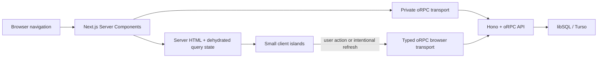

# SSR and data-loading architecture

This document describes the `rewrite` web application's data ownership after
the SSR review. It is intentionally narrower and more operational than the
project README.

## Design rules

1. A route is a Server Component unless browser APIs or interactive state make
   a client boundary necessary.
2. The server prepares data already known at navigation time. A chart or form
   being interactive is not a reason to fetch its initial data in the browser.
3. Server-only values stay outside the query cache. Data that an interactive
   island must read or mutate is prefetched with the same typed oRPC query
   options that its client hook uses, then dehydrated into that island.
4. Every server render and every authenticated browser identity owns a distinct
   `QueryClient`. Personalized query data is never stored in a module-global or
   cross-request cache.
5. Mutations invalidate the narrowest affected oRPC key. Whole-cache
   invalidation is reserved for operations that genuinely replace the whole
   local model, such as first-time setup, creating the active year, or erasing
   all account data.
6. Feature-scoped read models stay outside the year snapshot. A new entity
   family gets its own oRPC namespace, a shared input factory in
   `route-query-inputs.ts`, and page-level server prefetch using that exact
   query key. Its mutations invalidate only that namespace. The planner's
   unified agenda is the reference implementation: it projects related dated
   sources on demand without enlarging or invalidating `snapshot.get`.

These choices follow the current TanStack Query guidance for Server Components,
prefetching, request-scoped clients, dehydration and `HydrationBoundary`, and
the current oRPC guidance to share type-safe query-option factories across the
server/client boundary:

- [TanStack Query advanced SSR](https://tanstack.com/query/latest/docs/framework/react/guides/advanced-ssr)
- [TanStack Query SSR](https://tanstack.com/query/latest/docs/framework/react/guides/ssr)
- [TanStack Query prefetching](https://tanstack.com/query/latest/docs/framework/react/guides/prefetching)
- [oRPC SSR optimization](https://orpc.dev/docs/best-practices/optimize-ssr)
- [oRPC and TanStack Query](https://orpc.dev/docs/integrations/tanstack-query)

## Request flow

The production web and API processes are separate services. Server rendering
therefore uses `API_INTERNAL_URL` on the private deployment network instead of
round-tripping through the browser or the public API hostname. Importing the
router implementation directly into Next would couple the web bundle to the
database, Bun-only authentication code, and API process lifecycle. The oRPC
contracts and procedures remain the single business-logic and authorization
source of truth in both transports.

Only `accept-language`, `authorization`, `cookie`, and `user-agent` are
forwarded by the authenticated server transport, and those requests use
`no-store`. A separate headerless transport is reused only for the genuinely
public aggregate statistics procedure.

## Query ownership

### Server-only

| Operation         | Reason                                                                                                                               |
| ----------------- | ------------------------------------------------------------------------------------------------------------------------------------ |
| `profile.viewer`  | Authenticates the request and returns only id, name, email and avatar to seed the authenticated user context; it is not a live query |
| Admin access gate | Hides the admin route tree with `notFound()` before page work; backend admin procedures still enforce authority                      |
| `public.stats`    | Cached aggregate rendered into the landing HTML; no browser query cache or public rows are shipped                                   |

### Server-prefetched and hydrated

| Scope                   | Operations                                                                                       | Consumer                                                                          |
| ----------------------- | ------------------------------------------------------------------------------------------------ | --------------------------------------------------------------------------------- |
| Authenticated app shell | `years.list`, selected `snapshot.get`, `preferences.get`, `announcements.active`, `admin.access` | Year/period shell, sidebar, appearance, announcement and admin navigation islands |
| Onboarding              | `years.list`, `presets.list`, `preferences.get`                                                  | Interactive onboarding form                                                       |
| Review                  | `review.status` for the server-selected year                                                     | Review client island                                                              |
| Admin overview          | `admin.overview` with the shared initial input                                                   | Metrics and activity chart island                                                 |
| Admin users             | Initial empty-search `admin.users` page                                                          | Search/mutation island                                                            |
| Admin feedback          | Initial open-filter `admin.feedback` page                                                        | Filter/mutation island                                                            |
| Admin announcements     | `admin.announcements`                                                                            | Editor/mutation island                                                            |
| Profile settings        | `profile.uploadsEnabled`                                                                         | Avatar upload island                                                              |

All server and client consumers use the same generated oRPC query options and
input factories. The shared 30-second stale policy prevents an immediate mount
refetch while preserving normal client navigation and deliberate stale refresh.
The oRPC serializer is also used for query-key hashing and dehydrated values, so
`Date`, `BigInt`, and contract inputs survive the boundary without ad-hoc keys.
Pending-query dehydration is enabled for streaming-compatible boundaries and
errors are not redacted from Next's dynamic-rendering detection.

### Intentionally client-only

| Operation                                            | Why it stays in the browser                                                                                                                  |
| ---------------------------------------------------- | -------------------------------------------------------------------------------------------------------------------------------------------- |
| Account `getSession`, `listSessions`, `listAccounts` | The account screen manages the current Better Auth token, sessions and linked providers interactively                                        |
| Admin user search after the initial empty query      | Depends on live search/pagination state entered after hydration                                                                              |
| Admin feedback filter changes                        | Depend on a user-selected filter after hydration                                                                                             |
| User-selected year/snapshot changes                  | Depend on shell state changed during the current browser session; the selection is mirrored to a semantic cookie for the next SSR navigation |

Sign-in, sign-up, password reset and verification requests are user-triggered
auth mutations. They are deliberately client islands inside server-rendered
pages, not initial application reads.

### Mutations

Grade, subject, goal, card and custom-average changes invalidate the selected
year's exact snapshot key. Preferences use an optimistic update and the exact
preferences key. Announcement mutations invalidate the admin list and the
active-announcement key. Admin user/feedback mutations invalidate their route
families because the active search/filter can change membership. Cache-wide
invalidation remains only where the operation changes the full model.

## Parallelism and waterfalls

The authenticated layout starts viewer, years, preferences, announcements,
admin access, and a cookie-selected snapshot together. On a new or stale cookie
the snapshot has one real dependency on `years.list`; otherwise it starts in the
same batch. Calling the request-cached shell preparation from both a layout and
a nested page reuses the same in-flight work.

Route-specific reads start on the server and hydrate the existing browser
cache. The previous sequence—hydrate a page, fetch session/preferences, then
years, then snapshot, then route data—no longer blocks meaningful content or
repeats data that Next already had.

## Server/client boundary audit

At the `rewrite` baseline, 37 of 40 route pages and all three route layouts were
marked `"use client"`. The current tree has 21 client route pages and zero
client route layouts. The authenticated shell, admin/settings layouts, five
auth pages, six route-prefetched pages, and five form-wrapper pages moved their
boundary to a smaller island or removed it entirely.

The remaining client pages own real, continuously interactive year/period
state, filtering, editing, forms, theme controls, or Better Auth token actions.
Their initial snapshots are still server-prefetched; a client route module does
not imply an initial browser API request. Moving the shared domain graph itself
to a server-only representation would remove live simulations and make every
year/period change cross the network, so that larger tradeoff was not made just
to reduce a directive count.

## Streaming, Suspense and PPR

The landing hero is useful without its secondary public aggregates. Those
aggregates sit in one `Suspense` boundary and stream later; failure omits the
social proof instead of failing the route. Authenticated shell data and the
small route-specific reads are required to render their screens, so they are
prefetched in parallel behind the route's `loading.tsx` transition instead of
adding content-shifting Suspense boundaries around every panel.

Next 16 Partial Prerendering is controlled through Cache Components and changes
the rendering/cache model for the whole route tree. It is intentionally not
enabled here. Locale, theme and authenticated routes are cookie-dependent, and
the current benefit would be small compared with globally changing those
semantics. The supported dynamic SSR plus focused streaming boundary is the
safer architecture today. This should be reevaluated route by route when Cache
Components is adopted deliberately, following the current
[PPR](https://nextjs.org/docs/app/getting-started/partial-prerendering) and
[`cacheComponents`](https://nextjs.org/docs/app/api-reference/config/next-config-js/cacheComponents)
documentation.

## Authentication and cache safety

- The API remains the authorization authority. UI/admin guards are defense in
  depth and never replace protected procedures.
- Production sibling web/API hosts may opt into `AUTH_COOKIE_DOMAIN` with the
  narrowest shared parent domain so the incoming web request can carry the API
  session cookie. Local development keeps host-only cookies.
- The server `QueryClient` is React request-scoped. The reusable public cache
  contains aggregate public stats only.
- The browser `QueryClient` is keyed by authenticated user id and a reset
  generation. Sign-out, a 401, or identity replacement destroys and clears the
  old cache before another user can render it.
- Query keys need not include a user id because no cache instance survives an
  identity boundary. Sensitive procedure results are not prefetched merely to
  make a screen appear faster.

## Network comparison

Counts below are direct browser-initiated application reads on first navigation,
derived from the route/query graph and verified by SSR HTTP smoke tests. They do
not count Next.js document/RSC asset requests, and mutation/search requests are
listed separately.

| Representative route                        | Before | After | Eliminated or retained                                                                                        |
| ------------------------------------------- | -----: | ----: | ------------------------------------------------------------------------------------------------------------- |
| `/`                                         |      3 |     0 | Session, protected preferences and public stats moved out of the browser; stats render server-side            |
| Auth and legal pages                        |      2 |     0 | Global session and protected preferences reads removed from the public provider                               |
| `/onboarding`                               |      4 |     0 | Identity, preferences, years and presets prepared server-side; form mutations remain                          |
| Dashboard, subjects, insights, more, about  |      6 |     0 | Session, preferences, years, snapshot, announcements and admin access prepared in the shell                   |
| `/review`                                   |      7 |     0 | Common six plus review status prefetched/hydrated                                                             |
| Admin overview/users/feedback/announcements |      7 |     0 | Common reads and each initial admin query prepared server-side; searches, filter changes and mutations remain |
| Profile settings                            |      7 |     0 | Common reads plus upload availability prepared server-side                                                    |
| Account settings                            |      8 |     3 | Common reads removed; current session, session list and linked-account list intentionally remain client-side  |

The one transitional exception is a browser carrying only the legacy
`localStorage` year selection. If it disagrees with the new active-year cookie,
the first migrated visit can make one client snapshot request while it reconciles
the selection; steady-state visits use the cookie and make zero common reads.

## Navigation and failure behavior

Client-side Next navigation is preserved. Hydrated cache entries and stable
query keys are reused, stale reads follow the explicit policy, and back/forward
navigation retains the framework's router behavior. Server `fetchQuery` errors
for required route data propagate to Next rather than producing a misleading
empty client shell; the optional landing aggregate is the deliberate exception.
Session loss resets the personalized cache and redirects with the intended
return path.
